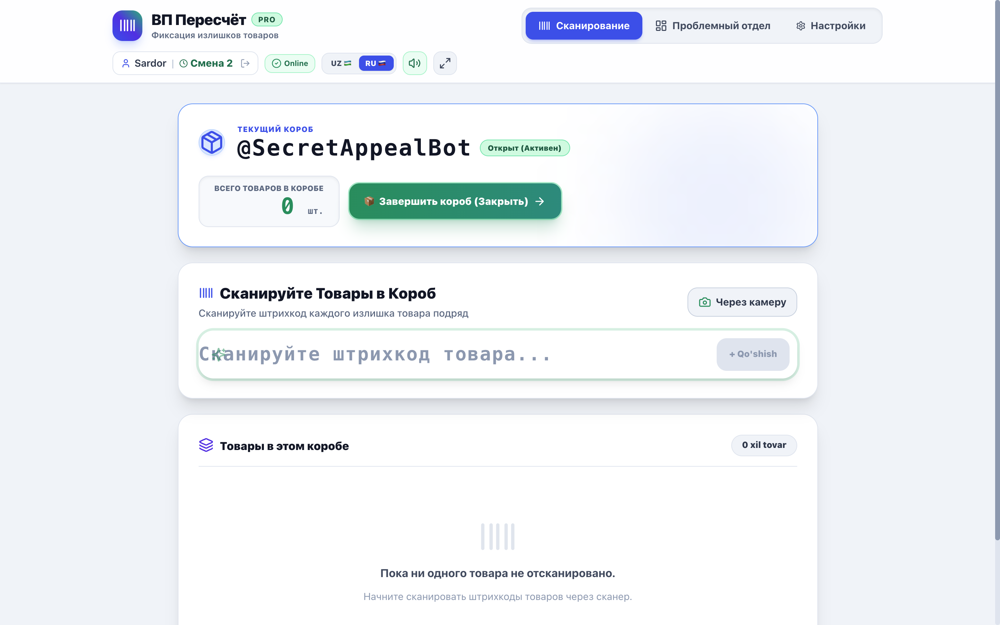
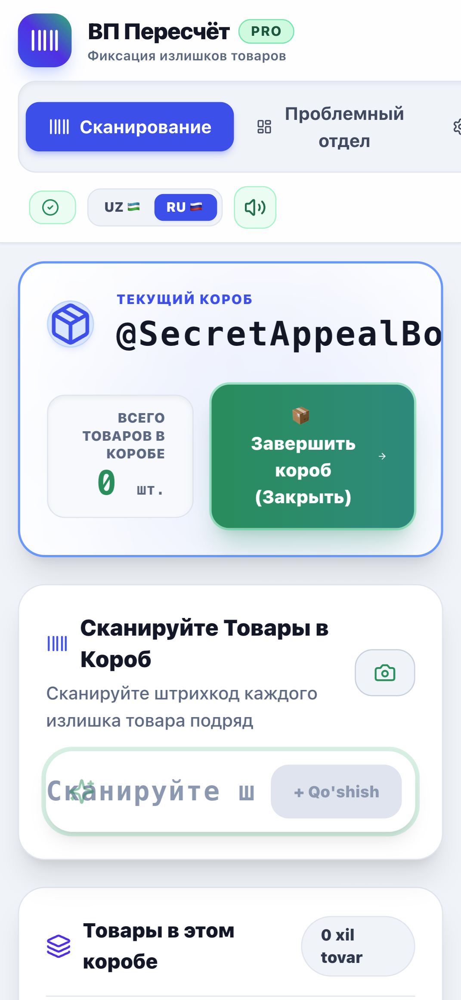
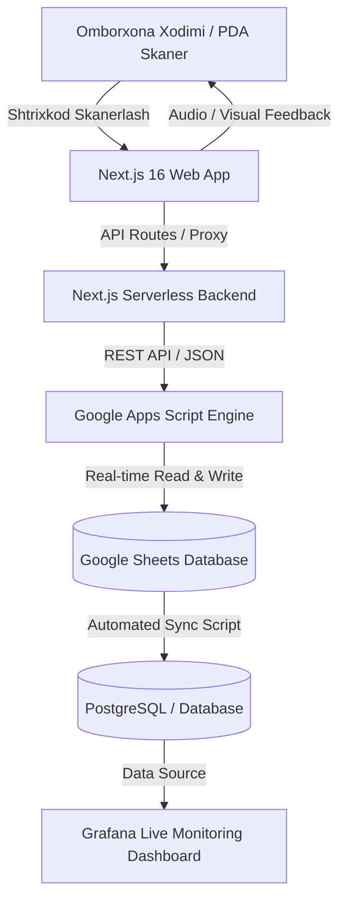

# 📦 Warehouse Inventory & Excess Items Management System
### *(VP Pershot — Omborxona va Ortiqcha Tovarlarni Boshqarish Tizimi)*

<p align="center">
  
  
  
  
  
  
  
</p>

---

## 🌟 Loyiha Haqida (Project Overview)

**Warehouse Inventory & Excess Items Management System** — zamonaviy logistika markazlari, taqsimlash omborxonalari (Fulfillment Centers) va muammoli tovarlar bo'limi (Problem Department) uchun ishlab chiqilgan yuqori tezlikdagi veb-ilovadir.

Tizim omborxona operatorlariga tovarlarni apparat skanerlari (Laser Barcode Terminals / PDA) yoki mobil kamera orqali real vaqtda skanerlash, ortiqcha tovarlarni aniqlash va qutilarga jamlash, kunlik normalarni hisoblash hamda barcha ma'lumotlarni to'g'ridan-to'g'ri **Google Sheets** va **Grafana** tizimlariga sinxronizatsiya qilish imkonini beradi.

---

## 📸 Dastur Ko'rinishlari (Screenshots & UI Showcase)

### 1. 🔐 Operator Avtorizatsiyasi va Smena Tanlash
Operatorlar o'z ismlari, smenalari va tegishli qavatni tanlab ish faoliyatini boshlaydilar.


---

### 2. ⚡ Real-Time Skanerlash va Tovarlar Nazorati
Tovarlar shtrixkodi apparat skaneri orqali skanerlanganda tizim bir zumda tovarni qutiga biriktiradi, audio-signal chaladi va qutidagi umumiy sonni yangilab boradi.


---

### 3. 📦 Muammoli Bo'lim (Problem Department & Box Flow)
Ortiqcha yoki nuqsonli tovarlar maxsus identifikatorli qutilarga jamlanadi va to'lgach, bitta tugma orqali yopiladi hamda arxivlanadi.



---

### 4. 📱 Mobil va PDA Skaner Moslashuvchanligi (PWA)
Ilova to'liq responsiv bo'lib, omborxona PDA skanerlari (Zebra, Honeywell, Chainway) hamda smartfonlarda qulay ishlash uchun moslashtirilgan.

<p align="center">
  
</p>

---

## 🚀 Asosiy Imkoniyatlar (Key Features)

- ⚡ **Tezkor Shtrixkod Skaneri**:
  - Apparat lazerli skanerlar (Keyboard Wedge) uchun maxsus buffer algoritmi;
  - Mobil kamera orqali to'g'ridan-to'g'ri shtrixkodlarni o'qish (ZXing Engine);
  - Tovarni to'g'ri/noto'g'ri skanerlanganligini bildiruvchi audio-signallar (Sound FX).
- 📦 **Ortiqcha Tovarlar va Qutilar Nazorati (Box Management)**:
  - Qutilarni ochish, tovarlarni jamlash va qutini yopish (Close Box) jarayoni;
  - Har bir tovar turi bo'yicha hisob-kitob.
- 🏢 **Ko'p qavatli va Ko'p smenali tuzilma**:
  - 1-etaj, 2-etaj, 3-etaj hamda 1-smena / 2-smena filtrlari.
- 📊 **Real-time Statistika va Analitika**:
  - Operatorlar uchun kunlik KPI / Plan monitoringi;
  - Oylik va kunlik yig'ma hisobotlar.
- 🔄 **To'liq Google Sheets & Google Apps Script Integratsiyasi**:
  - Qimmat va murakkab alohida ma'lumotlar bazasisiz, biznes uchun qulay Google Sheets jadvallari bilan ikki tomonlama avtomatik sinxronizatsiya.
- 📈 **Grafana Telemetriya & Monitoring**:
  - Omborxona unumdorligi va real vaqt statistikasi Grafana dashboardlariga uzatiladi.
- 📲 **PWA (Progressive Web Application)**:
  - Internetsiz oflayn holatda ham interfeys uzluksiz yuklanadi;
  - Mobil terminal va ishchi qurilmalarga ilova sifatida o'rnatiladi.

---

## 🏗 Tizim Arxitekturasi (System Architecture)



---

## 🛠 Texnologik Stek (Tech Stack)

| Qism | Texnologiya | Tavsif |
| :--- | :--- | :--- |
| **Frontend** | **Next.js 16 (App Router)** | Yuqori tezlik va optimallashtirilgan rendering |
| **UI Kutubxona** | **React 19 & Tailwind CSS v4** | Modern, responsiv va qulay foydalanuvchi interfeysi |
| **PWA & Offline** | **Service Workers & Web App Manifest** | PDA va mobil qurilmalarga o'rnatish imkoniyati |
| **Audio Engine** | **Web Audio API** | Real-time skanerlash va ogohlantirish tovushlari |
| **Backend & Sync** | **Google Apps Script & Sheets API** | Bulutli ma'lumotlarni boshqarish va saqlash |
| **Monitoring** | **Grafana Dashboard** | Jonli KPI va operatsion hisobotlar |

---

## ⚙️ O'rnatish va Ishga Tushirish (Getting Started)

### 1. Repozitoriyani klonlash
```bash
git clone https://github.com/theanvarow/Minni-app-for-Werehose-.git
cd Minni-app-for-Werehose-
```

### 2. Bog'liqliklarni o'rnatish (Install Dependencies)
```bash
npm install
```

### 3. Muhit o'zgaruvchilarini sozlash (`.env.local`)
Loyiha ildizida `.env.local` faylini yarating va quyidagi parametrlarni kiriting:
```env
GOOGLE_SCRIPT_URL=https://script.google.com/macros/s/YOUR_SCRIPT_ID/exec
NEXT_PUBLIC_APP_NAME="VP Pershot - Warehouse Management"
```

### 4. Dasturni ishlab chiqish (Dev) rejimida ishga tushirish
```bash
npm run dev
```
Brauzerda [http://localhost:3000](http://localhost:3000) manziliga kiring.

### 5. Production uchun yig'ish (Build)
```bash
npm run build
npm start
```

---

## 👨‍💻 Loyiha Muallifi (Author)

- **GitHub:** [@theanvarow](https://github.com/theanvarow)
- **Loyiha:** Mini App for Warehouse & Inventory Audit

---
⭐ *Loyiha yoqqan bo'lsa, repozitoriyaga Star (yulduzcha) qo'yishni unutmang!*
