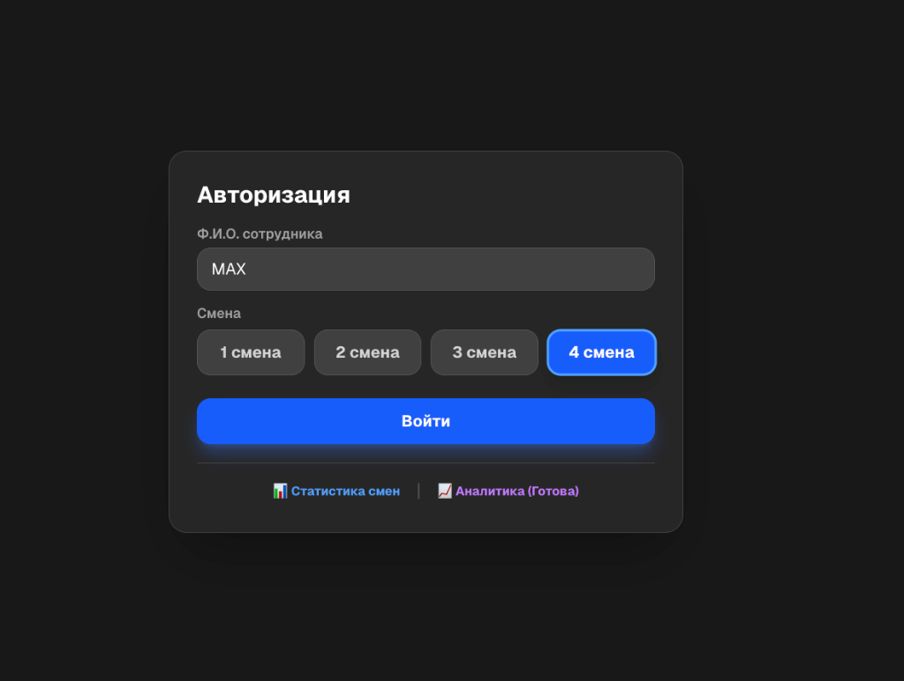
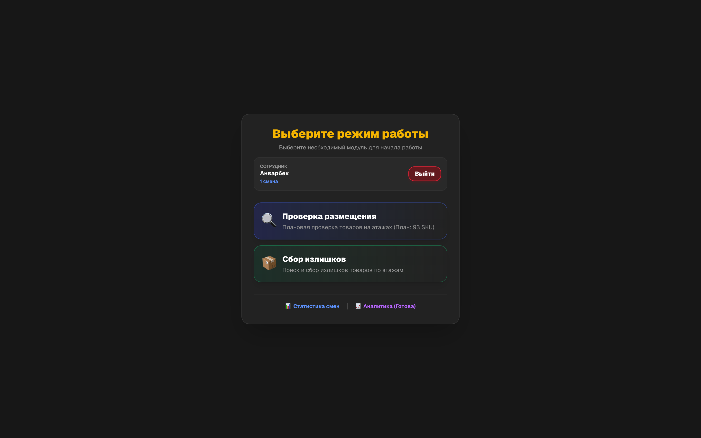
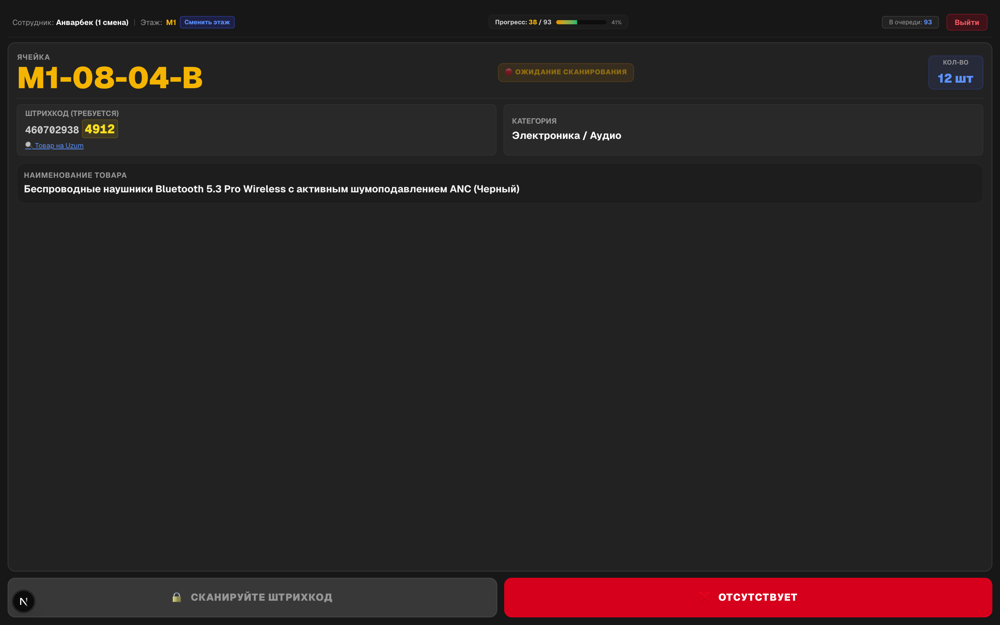
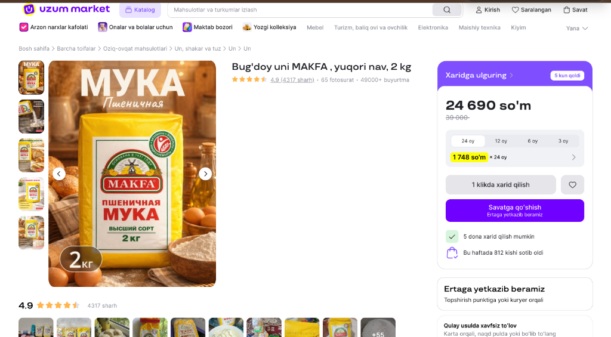
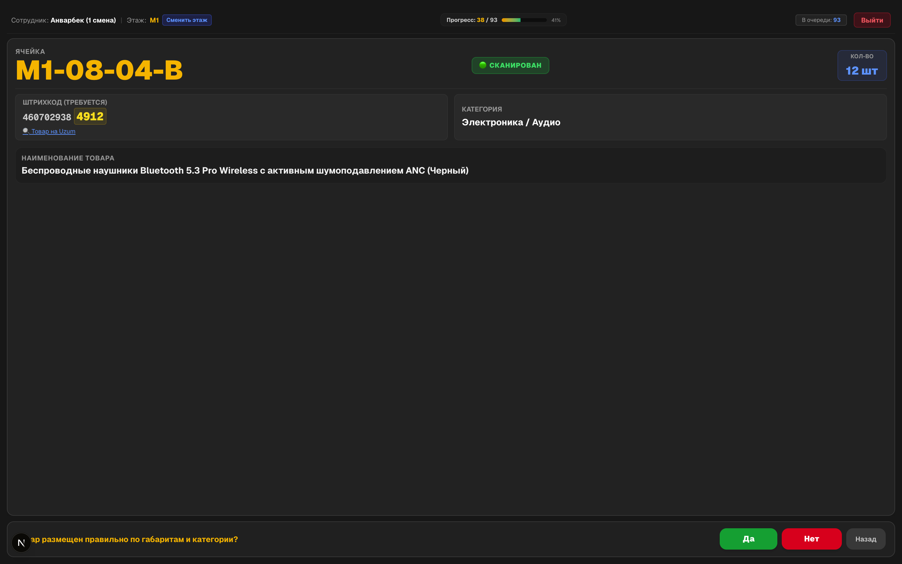
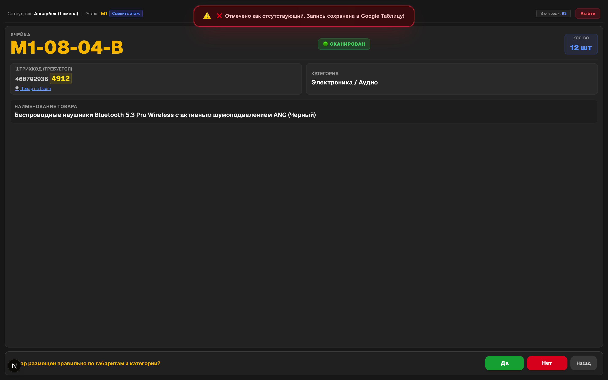
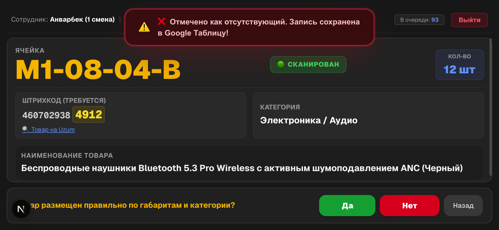
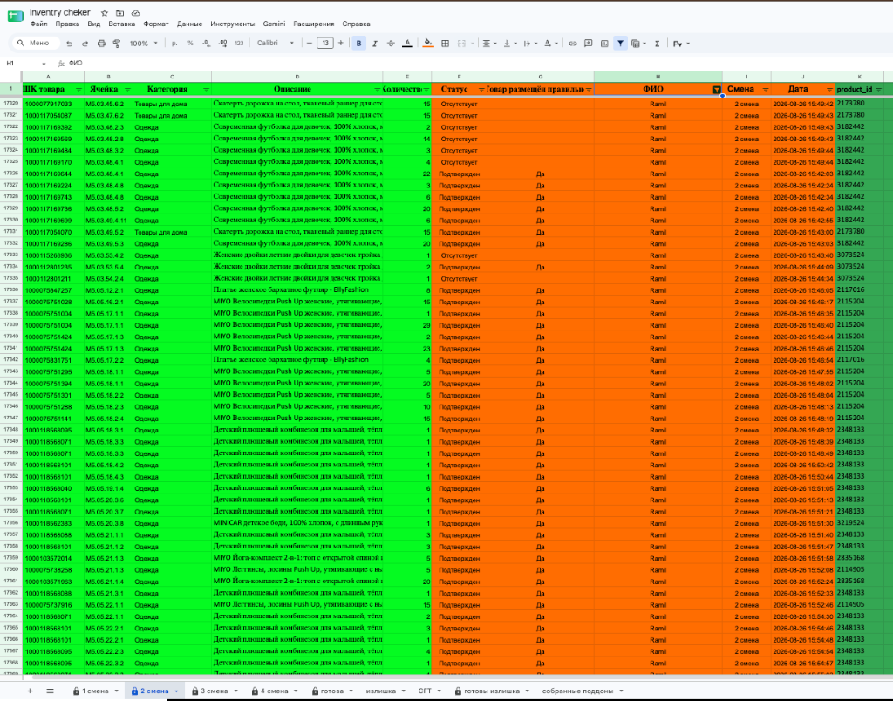
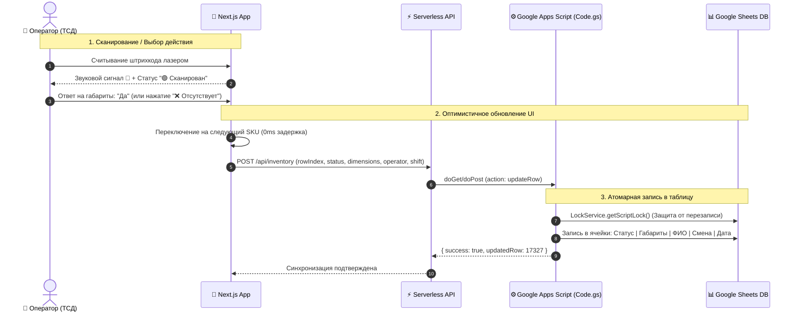

# 📦 Inventory Checker — Система Аудита и Инвентаризации Склада

<p align="center">
  <a href="https://inventory-checker-nu.vercel.app/">
    
  </a>
  
  
  
  
  
</p>

---

## 🌐 Рабочий проект (Live Web App)

> ### 🔗 **Прямая ссылка на рабочее веб-приложение:**  
> 👉 **[https://inventory-checker-nu.vercel.app/](https://inventory-checker-nu.vercel.app/)**  
> 
> *Приложение оптимизировано и доступно для работы на смартфонах, ПК и терминалах сбора данных (ТСД / PDA).*

---

## 🌟 О проекте (Project Overview)

**Inventory Checker** — это высокоскоростное веб-приложение (PWA), созданное для автоматизации складских процессов, проведения плановой инвентаризации, оперативного аудита размещения товаров по ячейкам/этажам и фиксации излишков на распределительных центрах (Fulfillment / WMS / Uzum Market).

Система разработана с упором на максимальное быстродействие операторов, работу с аппаратными лазерными сканерами штрихкодов (TSD / PDA терминалы сбора данных Zebra, Honeywell, Chainway), мгновенную валидацию местоположения SKU и синхронизацию в реальном времени с облачными таблицами **Google Sheets**.

---

## 📸 Интерфейс и Полный Складской Цикл (Screenshots & Workflow)

### 1. 🔐 Авторизация оператора и выбор смены
Быстрый вход сотрудника с сохранением персонального профиля, выбором рабочей смены (`1 смена`, `2 смена`, `3 смена`, `4 смена`) и доступом к сводным отчетам.



---

### 2. 🔀 Выбор модуля работы (Режимы системы)
Система поддерживает два ключевых складских бизнес-процесса:
- **🔍 Проверка размещения** — плановый аудит SKU по ячейкам (норматив: 93 SKU на оператора);
- **📦 Сбор излишков** — сбор, упаковка и фиксация неучтенных товаров по зонам склада.



---

### 3. 🏢 Выбор этажа и зоны хранения (M1 – M5, СГТ)
Удобная навигация по этажам мезонина (`M1`, `M2`, `M3`, `M4`, `M5`) и крупногабаритной зоне (`СГТ`) с динамической фильтрацией доступных заданий.


---

### 4. 🎯 Рабочий экран сканирования SKU (Ячейка и карточка товара)
Информативная карточка текущего задания:
- **Ячейка хранения:** Крупное отображение адреса (например, `M1-08-04-B` — Этаж `M1`, Ряд `08`, Стеллаж `04`, Полка `B`);
- **Штрихкод товара:** Полный номер + **визуальная подсветка последних 4 цифр** для быстрой сверки оператором;
- **🔍 Товар на Uzum:** Прямая интерактивная ссылка для мгновенного открытия карточки товара на Uzum Market (фото, характеристики, комплектация);
- **Индикатор статуса:** `🔴 ОЖИДАНИЕ СКАНИРОВАНИЯ` (кнопка подтверждения заблокирована до сканирования штрихкода).



---

### 5. 🔍 Интеграция с Uzum Market: Поиск и визуальная идентификация товара по фото
Для исключения пересорта и визуальной сверки оператор в 1 клик нажимает **`🔍 Товар на Uzum`**:
- **Прямой переход к карточке товара на Uzum Market:** Моментальное открытие оригинальной страницы товара со всеми фотографиями, фасовкой и упаковкой;
- **Галерея ракурсов и отзывов:** Просмотр внешнего вида пачки/коробки (например, *"Bug'doy uni MAKFA, yuqori nav, 2 kg"*), веса, штрихкода и комплектации;
- **Снижение ошибок аудита до 0%:** Оператор визуально сравнивает реальный товар на полке с фотографией в маркетплейсе перед подтверждением.



---

### 6. ⚡ Процесс сканирования и проверка габаритов / категории
1. При считывании штрихкода лазерным лучом сканера статус меняется на `🟢 СКАНИРОВАН`;
2. Воспроизводится звуковой сигнал подтверждения (двойной звонок);
3. Автоматически открывается панель подтверждения соответствия стандартам:
   > *"Товар размещен правильно по габаритам и категории? [ ✅ Да ] / [ ❌ Нет ]"*



---

### 7. ❌ Обработка отсутствующих позиций и Real-Time Toast
Если товара нет в указанной ячейке:
- Оператор нажимает кнопку **«❌ Отсутствует»**;
- Воспроизводится предупреждающий сигнал;
- Всплывает уведомление о сохранении данных;
- В **Google Таблицу** моментально вносится запись со статусом `Отсутствует`, именем сотрудника и датой/временем;
- Система мгновенно переходит к следующему SKU без задержек.



---

### 8. 📱 Адаптация под мобильные ТСД (PDA / Handheld Scanners)
Интерфейс оптимизирован под промышленные экраны терминалов сбора данных: крупные интерактивные элементы, отсутствие лишнего скролла, высокая контрастность для работы при любом складском освещении.

<p align="center">
  
</p>

---

## 🔄 Механизм фиксации данных в Google Sheets (Backend Workflow)

Каждое действие оператора на терминале моментально отражается в облачной таблице через бессерверный движок **Google Apps Script**:





### 📋 Структура и фиксация колонок в Google Sheets:
| Колонка | Название поля | Пример значения | Описание и логика фиксации |
| :--- | :--- | :--- | :--- |
| **A** | `ШК товара` | `1000117169224` | Штрихкод товара для сверки сканером |
| **B** | `Ячейка` | `M5.03.48.4.8` | Точный адрес ячейки хранения (Этаж, Ряд, Стеллаж, Полка) |
| **C** | `Категория` | `Одежда` | Категория номенклатуры |
| **D** | `Описание` | `Современная футболка для девочек, 100% хлопок` | Полное наименование товара |
| **E** | `Количество` | `3` | Количество товара в ячейке |
| **F** | `Статус` | **`Подтвержден`** / **`Отсутствует`** | **Фиксируется скриптом**: результат проверки оператором |
| **G** | `Товар размещён правильно` | **`Да`** / *(пусто)* | **Фиксируется скриптом**: соответствие габаритам и категории |
| **H** | `ФИО` | `Ramil` | **Фиксируется скриптом**: имя авторизованного сотрудника |
| **I** | `Смена` | `2 смена` | **Фиксируется скриптом**: рабочая смена оператора |
| **J** | `Дата` | `2026-08-26 15:42:24` | **Фиксируется скриптом**: точная временная метка аудита (Timestamp) |
| **K** | `product_id` | `3182442` | Идентификатор товара в системе / Uzum Market |

---

## 🚀 Ключевые преимущества и функционал

- ⚡ **Аппаратный ввод штрихкодов (Keyboard Wedge)**:
  - Автоматический перехват потока со сканера за миллисекунды;
  - Мгновенное подтверждение позиции без необходимости кликать мышкой или тапать по экрану.
- 🔍 **Интеграция с Uzum Market**:
  - Быстрый переход к карточке товара по SKU для визуальной идентификации упаковки и исключения пересорта.
- 🔊 **Звуковая сигнализация (Web Audio API Synthesizer)**:
  - Разные типы звуковых уведомлений: успешное сканирование, предупреждение при ошибке штрихкода, завершение дневной нормы.
- 🔒 **Защита от конфликтов операторов (Row Locking)**:
  - Временная блокировка строк на уровне бэкенда исключает одновременную проверку одного товара двумя сотрудниками.
- 📈 **Мониторинг прогресса и KPI**:
  - Интерактивный прогресс-бар нормы (93 SKU на оператора / 600 SKU на смену);
  - Детальная статистика по сменам и модуль аналитики «Готова».
- 📲 **PWA & Offline Capability**:
  - Установка как нативного приложения на Android / iOS / Windows ТСД;
  - Быстрая работа даже при нестабильном складском Wi-Fi.

---

## 🛠 Стек технологий (Tech Stack)

| Компонент | Технология | Описание |
| :--- | :--- | :--- |
| **Фреймворк** | **Next.js 16 (App Router)** | Высокая производительность и Serverless роуты |
| **Библиотека интерфейса** | **React 19 & Tailwind CSS v4** | Современный адаптивный UI с темной темой |
| **Складской сканер** | **Hardware Event Buffer + ZXing** | Считывание аппаратными лазерными и оптическими сканерами |
| **Звуковой движок** | **Web Audio API (Synthesizer)** | Встроенная синтезированная звуковая обратная связь |
| **База данных и API** | **Google Sheets & Google Apps Script** | Облачная табличная СУБД с транзакционной логикой |
| **Деплой** | **Vercel** | Global Edge Network с авто-деплоем |

---

## ⚙️ Локальный запуск и установка (Getting Started)

### 1. Клонирование репозитория
```bash
git clone https://github.com/theanvarow/Minni-app-for-Werehose-.git
cd Minni-app-for-Werehose-
```

### 2. Установка зависимостей
```bash
npm install
```

### 3. Настройка переменных окружения (`.env.local`)
Создайте файл `.env.local` в корне проекта:
```env
GOOGLE_SCRIPT_URL=https://script.google.com/macros/s/ВАШ_SCRIPT_ID/exec
```

### 4. Запуск локального сервера разработки
```bash
npm run dev
```
Откройте браузер по адресу: [http://localhost:3000](http://localhost:3000)

### 5. Сборка для Production
```bash
npm run build
npm start
```

---

## 👨‍💻 Автор проекта

- **GitHub:** [@theanvarow](https://github.com/theanvarow)
- **Live Demo:** [https://inventory-checker-nu.vercel.app/](https://inventory-checker-nu.vercel.app/)

---
⭐ *Если вам понравился проект, поставьте Star на GitHub!*
