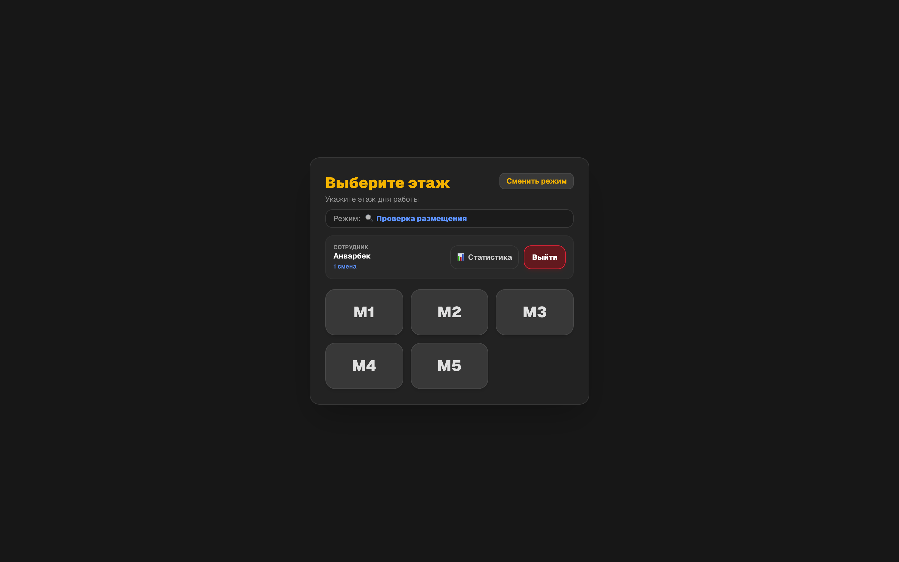
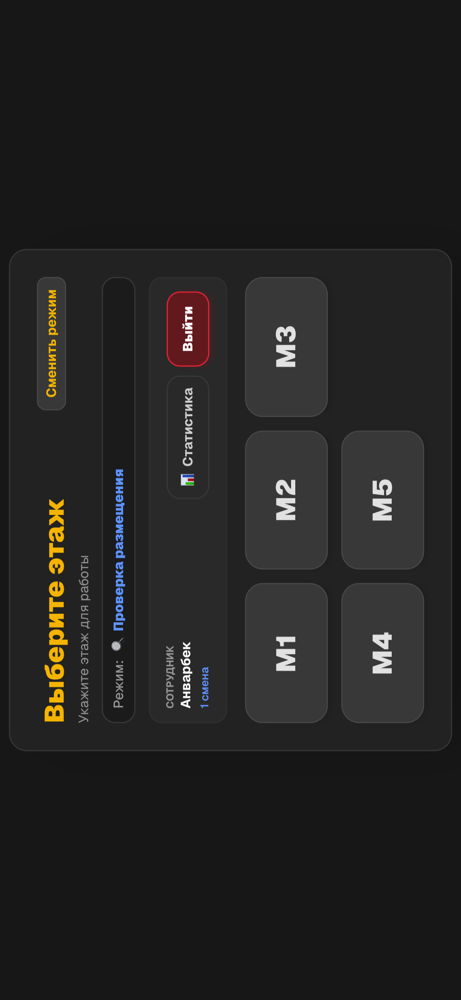
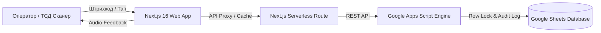

# 📦 Inventory Checker — Система Аудита и Инвентаризации Склада

<p align="center">
  <a href="https://inventory-checker-nu.vercel.app/">
    
  </a>
  
  
  
  
  
</p>

---

## 🌐 Рабочий проект (Live Deployment)

🔗 **Рабочая ссылка на проект:** [https://inventory-checker-nu.vercel.app/](https://inventory-checker-nu.vercel.app/)

---

## 🌟 О проекте (Project Overview)

**Inventory Checker** — это высокоскоростное веб-приложение (PWA) для автоматизации складских процессов, проведения плановой инвентаризации, аудита размещения товаров по ячейкам/этажам и фиксации излишков на распределительных центрах (Fulfillment / WMS).

Система разработана с упором на максимальное быстродействие операторов, работу с аппаратными лазерными сканерами штрихкодов (TSD / PDA терминалы сбора данных), валидацию местоположения SKU и синхронизацию в реальном времени с облачными таблицами **Google Sheets** без необходимости развертывания тяжелых СУБД.

---

## 📸 Интерфейс Системы (Скриншоты и Модули)

### 1. 🔐 Авторизация оператора и выбор смены
Быстрый вход сотрудника, фиксация рабочей смены (1-смена / 2-смена) и персонального прогресса выполнения плана.


---

### 2. 🔀 Выбор модуля работы (Режимы системы)
Система поддерживает два основных бизнес-процесса склада:
- **🔍 Проверка размещения** — плановый аудит SKU по ячейкам (норматив: 93 SKU на оператора);
- **📦 Сбор излишков** — сбор и фиксация неучтенных товаров по зонам хранения.


---

### 3. 🏢 Выбор этажа и зоны хранения (M1 – M5, СГТ)
Удобная навигация по этажам мезонина (M1, M2, M3, M4, M5) и крупногабаритной зоне (СГТ) с интеллектуальным распределением очереди товаров между сотрудниками.


---

### 4. 📊 Статистика смен и KPI выполнения норм
Модуль детальной аналитики: дневной план (600 SKU на смену), фильтрация по датам, учет подтвержденных и отсутствующих позиций в реальном времени.



---

### 5. 📱 Адаптация под мобильные ТСД (PDA / Handheld Scanners)
Полная поддержка ландшафтного режима для промышленных терминалов сбора данных (Zebra, Honeywell, Chainway, Newland) и смартфонов через PWA.

<p align="center">
  
</p>

---

## 🚀 Ключевые возможности (Key Features)

- ⚡ **Аппаратный ввод штрихкодов (Keyboard Wedge)**:
  - Автоматический перехват потока со сканера за миллисекунды;
  - Мгновенное подтверждение позиции без необходимости кликать мышкой или тапать по экрану.
- 🔊 **Звуковая сигнализация (Web Audio API)**:
  - Разные типы звуковых уведомлений: успешное сканирование, предупреждение при ошибке штрихкода, завершение нормы.
- 🔒 **Защита от конфликтов операторов (Row & Aisle Locking)**:
  - Кэширование и временная блокировка рядов/ячеек для предотвращения одновременной проверки одного товара несколькими сотрудниками.
- 🔄 **Двусторонняя синхронизация с Google Sheets**:
  - Быстрое чтение и запись через оптимизированный бэкенд на **Google Apps Script**;
  - Бессерверная архитектура с нулевой стоимостью хостинга БД.
- 📈 **Мониторинг прогресса и геймификация**:
  - Интерактивный прогресс-бар нормы (93 SKU);
  - Анимация при успешном закрытии дневного плана.
- 📲 **PWA & Offline Capability**:
  - Установка как нативного приложения на Android / iOS / Desktop;
  - Сервис-воркеры для кэширования статики и интерфейса.

---

## 🏗 Архитектура Системы (Architecture)



---

## 🛠 Стек технологий (Tech Stack)

| Компонент | Технология | Описание |
| :--- | :--- | :--- |
| **Фреймворк** | **Next.js 16 (App Router)** | Высокая производительность и Serverless роуты |
| **Библиотека интерфейса** | **React 19 & Tailwind CSS v4** | Современный адаптивный UI с темной темой |
| **Складской сканер** | **Hardware Event Buffer + ZXing** | Считывание аппаратными и оптическими сканерами |
| **Звуковой движок** | **Web Audio API (Synthesizer)** | Встроенная синтезированная звуковая обратная связь |
| **База данных и API** | **Google Sheets & Google Apps Script** | Облачная табличная СУБД с транзакционной логикой |
| **Деплой** | **Vercel** | Global Edge Network с авто-деплоем |

---

## ⚙️ Локальный запуск и установка (Getting Started)

### 1. Клонирование репозитория
```bash
git clone https://github.com/theanvarow/Minni-app-for-Werehose-.git
cd Minni-app-for-Werehose-
```

### 2. Установка зависимостей
```bash
npm install
```

### 3. Настройка переменных окружения (`.env.local`)
Создайте файл `.env.local` в корне проекта:
```env
GOOGLE_SCRIPT_URL=https://script.google.com/macros/s/ВАШ_SCRIPT_ID/exec
```

### 4. Запуск локального сервера разработки
```bash
npm run dev
```
Откройте браузер по адресу: [http://localhost:3000](http://localhost:3000)

### 5. Сборка для Production
```bash
npm run build
npm start
```

---

## 👨‍💻 Автор проекта

- **GitHub:** [@theanvarow](https://github.com/theanvarow)
- **Live Demo:** [https://inventory-checker-nu.vercel.app/](https://inventory-checker-nu.vercel.app/)

---
⭐ *Если вам понравился проект, поставьте Star на GitHub!*
